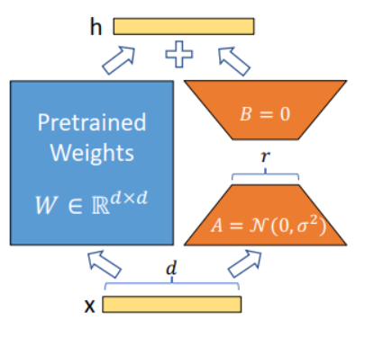

# 大模型微调(Fine-tuning)

## 什么是大模型微调
大模型微调(Fine-tuning)是指在预训练大模型（如 GPT、LLaMA 等）的基础上，使用特定领域或任务的数据进行二次训练，使模型更好地适应特定应用场景的过程。

通过微调，可以在保留模型原有通用知识的基础上，增强其在特定领域的表现能力。

微调过程实质上是一种知识迁移，将预训练阶段获得的通用语言理解能力，转化为解决特定问题的能力。

与从零开始训练相比，微调利用了预训练模型中已有的知识结构，大大提高了训练效率并降低了资源需求。
## 为什么需要大模型微调

### 弥补通用模型的不足

- 领域专业化：预训练模型虽具有广泛的通用知识，但在特定专业领域（如医疗、法律、金融等）的知识深度不足，微调可以增强模型在这些专业领域的表现。
- 任务针对性：通用模型在特定任务上的表现可能次优，如摘要生成、情感分析等，微调可以显著提升模型在特定任务上的性能。

### 解决资源与成本问题

- 降低计算成本：从头训练大模型需要巨大的计算资源，而微调只需要较少的计算资源即可完成。
- 减少数据需求：微调只需要相对较少的领域数据，而非亿级别的预训练数据集。

### 改善模型行为

- 减少幻觉：微调可以减少模型产生虚假内容的倾向，提高输出的准确性和可靠性。
- 安全合规：通过微调可以使模型的输出更符合安全、道德和法律要求。
- 定制化输出：可以调整模型的输出风格、格式和内容，以满足特定应用需求。

## 微调分类及特点
### 指令微调(Instruction Fine-Tuning，IFT)

**原理：** 使用高质量的任务指令数据，通过优化输入的指令（prompt）来引导模型的行为，使其适应不同的任务需求。

**特点：**

- 依赖大规模、高质量的任务指令数据。
- 适用于多任务学习，能够提升模型对不同任务的泛化能力。
- 不改变模型参数，仅通过优化指令进行调整。

**缺点：**

- 需要高质量的指令数据集。
- 在某些特定任务上效果可能不如全参数微调。

### 全参数微调(Full Fine Tuning，FFT)
**原理：** 调整整个模型的所有参数，使其适应特定任务。

**特点：**

- 能够获得最优的任务适配性和性能。
- 适用于数据量充足、计算资源充裕的场景。
- 适用于长期部署的专用模型。

**缺点：**

- 计算资源消耗大，对存储和训练硬件要求高。
- 可能导致模型的灾难性遗忘（Catastrophic Forgetting）。

### 参数高效微调（Parameter-Efficient Fine-Tuning，PEFT）
**原理：** 只调整部分参数（如低秩矩阵、适配器层等），降低计算开销，同时保持模型的原始能力。

**特点：**
- 计算成本较低，适用于资源受限环境。
- 适用于多任务场景，灵活性高。
- 通过少量可训练参数实现模型微调。

**缺点：**
- 可能损失一定的模型泛化能力。
- 需要针对不同任务选择合适的参数高效微调方法。

## 常见的微调技术
### LoRA（Low-Rank Adaptation）

**原理：**



模型是过参数化的，它们有更小的内在维度，模型主要依赖于这个低的内在维度（low intrinsic dimension）去做任务适配。

假设模型在适配任务时参数的改变量是低秩的，由此引出低秩自适应方法lora，通过低秩分解来模拟参数的改变量，从而以极小的参数量来实现大模型的间接训练

LoRA基于这样一个假设：模型适应过程中的参数更新矩阵往往是低秩的。因此，可以用两个小矩阵的乘积来近似权重更新，大幅减少可训练参数数量。

---

LoRA 技术使用新参数根据新数据训练 AI 模型。

不是训练整个模型和所有预训练权重，而是将它们放在一边或“冻结”，然后训练样本量较小的参数。这些样本量被称为“低秩”自适应矩阵，LoRA 就是这么来的。

它们之所以被称为低秩矩阵，是因为它们的参数和权重数量较少。训练完成后，它们会与原始参数组合，然后作为一个单独的矩阵。这样一来，就可以更高效地进行微调

---

交叉注意力层的权重被排列成矩阵形式。矩阵就像 Excel 电子表格中按列和行排列的一系列数字。LoRA 模型通过将其权重添加到这些矩阵中来对模型进行微调。

LoRA 模型文件如何更小，即使它们需要存储相同数量的权重？LoRA 的技巧在于将矩阵分解为两个较小（低秩）的矩阵。这样可以存储更少的数字。我们通过以下示例来说明这一点。

假设模型有一个具有 1,000 行和 2,000 列的矩阵。这就是要在模型文件中存储的 2,000,000 个数字（1,000 x 2,000）。LoRA 将该矩阵分解为一个 1,000x2 的矩阵和一个 2x2,000 的矩阵。

这只需要 6,000 个数字（1,000 x 2 + 2 x 2,000），是原始矩阵大小的 333 倍。这就是 LoRA 文件更小的原因。

LoRA 将一个大矩阵分解为两个小的低秩矩阵。

但是，这样做是否会产生任何问题？研究人员发现，在交叉注意力层中进行这样的操作并不会对微调的效果产生太大影响。因此，我们是安全的


[细说fine-tuning](https://blog.csdn.net/qq_43456016/article/details/138252294)

[LoRA论文](https://arxiv.org/abs/2106.09685)

**核心：**

为原模型的权重矩阵W添加一个低秩分解矩阵ΔW=BA，其中B和A分别是低秩矩阵，秩r远小于原矩阵维度。

**实现关键步骤：**

1. 冻结预训练模型的原始权重
2. 为每个需要微调的权重矩阵W添加低秩矩阵对B和A
3. 仅训练这些低秩矩阵
4. 推理时将ΔW与原始权重W相加

#### LoRA线性层实现
```python
import torch
import torch.nn as nn
class Linear(nn.Module):
    def __init__(self, in_features: int, out_features: int, bias: bool, 
                 r: int, alpha: int = None):
        super().__init__()
        self.in_features = in_features
        self.out_features = out_features
        
        # 设置缩放因子
        if alpha is None:
            alpha = r
        self.scaling = alpha / r
        
        # 原始权重（冻结）
        self.weight = nn.Parameter(torch.empty((out_features, in_features)))
        self.weight.requires_grad = False
        
        # 偏置项处理
        if bias:
            self.bias = nn.Parameter(torch.empty(out_features))
            self.bias.requires_grad = False
        else:
            self.bias = None
            
        # LoRA参数初始化
        self.lora_a = nn.Parameter(torch.empty((r, in_features)))
        self.lora_b = nn.Parameter(torch.empty((out_features, r)))
        
        # 初始化
        with torch.no_grad():
            nn.init.kaiming_uniform_(self.lora_a, a=5 ** 0.5)
            nn.init.zeros_(self.lora_b)

    def forward(self, x: torch.Tensor):
        # 原始线性变换
        result = nn.functional.linear(x, self.weight, bias=self.bias)
        # 添加LoRA部分
        result += (x @ self.lora_a.T @ self.lora_b.T) * self.scaling
        return result

```

#### LoRA嵌入层实现
```python
import torch
import torch.nn as nn
class Embedding(nn.Module):
    def __init__(self, num_embeddings: int, embedding_dim: int,
                 r: int, alpha: int = None):
        super().__init__()
        
        # 设置缩放因子
        if alpha is None:
            alpha = r
        self.scaling = alpha / r
        
        # 原始嵌入权重（冻结）
        self.weight = nn.Parameter(torch.empty((num_embeddings, embedding_dim)))
        self.weight.requires_grad = False
        
        # LoRA参数初始化
        self.lora_a = nn.Parameter(torch.empty((r, num_embeddings)))
        self.lora_b = nn.Parameter(torch.empty((embedding_dim, r)))
        
        # 初始化
        with torch.no_grad():
            nn.init.normal_(self.lora_a)
            nn.init.zeros_(self.lora_b)

    def forward(self, x: torch.Tensor):
        # 原始嵌入查找
        result = nn.functional.embedding(x, self.weight)
        # 添加LoRA部分
        result += (nn.functional.embedding(x, self.lora_a.T) @ self.lora_b.T) * self.scaling
        return result
```

### QLoRA（Quantized Low-Rank Adaptation）
**原理：**

QLoRA结合了模型量化和LoRA技术，通过量化预训练权重来节省内存，同时使用LoRA进行参数高效微调。

“QLoRA” 中的“Q”代表“量化”。在这种情况下，量化模型意味着将非常复杂、精确的参数（大量小数和大量内存）压缩成更小、更简洁的参数（较少的小数和较少的内存）。

它的目标是使用单个图形处理单元（GPU）的存储和内存对模型的一部分进行微调。

它使用 4 位 NormalFloat（NF4）来实现这一点，这种新的数据类型能够量化矩阵，而且所需内存甚至比 LoRA 更少。

通过将参数压缩成更小、更易于管理的数据，它可以将所需的内存占用量减少到原始大小的 4 

**核心：**

将原始模型量化为4比特精度，同时使用LoRA进行微调，并采用分页优化等技术减少内存使用。

1. Normal Float 4-Bit量化
2. Double Quantization 双量化
3. Paged Optimers

**实现关键步骤：**
1. 将预训练模型量化至4比特
2. 应用LoRA技术添加可训练的低秩参数
3. 使用NF4（Normal Float 4）量化方案
4. 采用双重量化技术进一步节省内存
5. 使用分页优化技术处理激活值

在加载模型的时候，我们增加一个BitsAndBytesConfig的参数
```python
if model_name == "baichuan-7B" or model_name == "Baichuan-13B-Chat":
    model = AutoModelForCausalLM.from_pretrained(model_args.model_name_or_path,trust_remote_code=True,torch_dtype=torch_dtype,load_in_4bit=True, 
                                        quantization_config=BitsAndBytesConfig(
                                        load_in_4bit=True,
                                        bnb_4bit_compute_dtype=torch_dtype,
                                        bnb_4bit_use_double_quant=True,
                                        bnb_4bit_quant_type="nf4",
                                        llm_int8_threshold=6.0,
                                        llm_int8_has_fp16_weight=False))
```


[QLoRA 论文](https://arxiv.org/abs/2305.14314)

[QLoRA 实践](https://blog.csdn.net/FrenzyTechAI/article/details/132686051)


### 适配器调整（Adapter Tuning）
**原理：**

在原始模型层之间插入小型可训练模块（适配器），原模型参数保持不变，只训练这些新增的适配器模块。

---

该方法设计了Adapter结构，并将其嵌入Transformer的结构里面，针对每一个Transformer层，增加了两个Adapter结构(分别是多头注意力的投影之后和第二个feed-forward层之后)，

在训练时，固定住原来预训练模型的参数不变，只对新增的 Adapter 结构和 Layer Norm 层进行微调，从而保证了训练的高效性。

每当出现新的下游任务，通过添加Adapter模块来产生一个易于扩展的下游模型，从而避免全量微调与灾难性遗忘的问题。

---

在预训练模型的中间层添加适配器模块，并对其权重进行恒等初始化，这样训练开始时模型性能和原始模型非常接近。

适配器模块通常由简单的前馈神经网络组成，其输入来自任务独立且冻结的多层感知器（MLP）模块和自注意力模块。

这些适配器模块通过学习任务相关的表示来适应下游任务，但其输入仍然是从任务独立且冻结的层中获得的。

**核心：**
适配器通常由降维层、非线性激活函数和升维层组成，形成"瓶颈"结构，大幅减少参数量。

**实现关键步骤：**

1. 冻结预训练模型的所有参数
2. 在Transformer层后添加适配器模块
3. 适配器内部包含降维层和升维层
4. 仅训练适配器模块的参数
5. 添加残差连接以稳定训练

[适配器调整](https://blog.csdn.net/2301_77818837/article/details/135355919)

### 前缀调整（Prefix Tuning）
**原理：**
在模型输入序列的前面添加一组可训练的连续向量（前缀），这些向量可以引导模型生成特定风格或领域的内容。

它在每一层transformer的自注意力模块中的key、value向量前添加一个向量序列，再通过后向传播来求解。

后来，经过一系列实验发现，直接求解这个前缀向量对学习率和参数的初始化非常敏感，导致微调的性能不稳定。

因此，论文原作者又对训练过程进行了改进，训练时加入了一个多层感知网络（MLP）

**核心：**
为模型的每一层添加可训练的前缀向量，这些向量在序列长度维度上扩展了注意力机制的上下文。

**实现关键步骤：**

1. 在每层自注意力机制的K和V矩阵前添加可训练的前缀向量
2. 冻结预训练模型的参数
3. 仅训练这些前缀向量
4. 使用参数化网络生成前缀，以提高稳定性


整体流程和适配器微调（Adapter tuning）相同，只是把BnConfig换成了PrefixTuningConfig，主要介绍下PrefixTuningConfig类，它有以下参数：

- flat：是否需要加入多层感知网络来训练前缀参数。如果是False，则是需要；如果是True，则直接训练。
- encoder_prefix：如果是True，只在encoder里加入前缀参数。
- bcross_prefix：如果是True，只在交叉注意力里加入前缀参数。
- prefix_length：设置前缀的长度。

```python
from adapters import PrefixTuningConfig
 
# 配置前缀参数
adapter_name = "trouble_shooting"
config = PrefixTuningConfig(flat=False, encoder_prefix=True, prefix_length=12)
model.add_adapter(adapter_name, config=config)
 
#… … …

# 训练前缀参数
model.train_adapter(adapter_name)
 
#… … … 
# 删除训练用的多层感知网络
model.eject_prefix_tuning(adapter_name)
```

[模型微调方法Prefix-Tuning](https://blog.csdn.net/m0_66890670/article/details/142942034)

[前缀调整论文](https://arxiv.org/abs/2101.00190)

### 提示调整（Prompt Tuning）
**原理：**
在输入嵌入层添加一组可学习的软提示向量，这些向量会与输入序列一起传入模型，引导模型行为。

**核心：**
只在输入层添加可训练的连续向量，而不是在每一层都添加，简化了前缀调整方法。

- 离散提示（Discrete Prompts）：手工设计的一段自然语言提示，例如在输入前加一句“请用情感分析的方式理解以下文本：”。
- 连续提示（Continuous Prompts）：一组可学习的嵌入向量，这些向量不一定对应真实的语言单词，而是直接作用于模型的输入嵌入层

**实现关键步骤：**

1. 在输入嵌入序列前添加一组可训练的向量（软提示）
2. 冻结原始模型参数
3. 只训练这组软提示向量
4. 通过反向传播优化软提示向量

```python
class PrefixEncoder(torch.nn.Module):
        ......
        if self.prefix_projection and not config.inference_mode:
            # Use a two-layer MLP to encode the prefix
            self.embedding = torch.nn.Embedding(num_virtual_tokens, token_dim)
            self.transform = torch.nn.Sequential(
                torch.nn.Linear(token_dim, encoder_hidden_size),
                torch.nn.Tanh(),
                torch.nn.Linear(encoder_hidden_size, num_layers * 2 * token_dim),
            )
        else:
            self.embedding = torch.nn.Embedding(num_virtual_tokens, num_layers * 2 * token_dim)

    def forward(self, prefix: torch.Tensor):
        if self.prefix_projection:
            prefix_tokens = self.embedding(prefix)
            past_key_values = self.transform(prefix_tokens)
        else:
            past_key_values = self.embedding(prefix)
        return past_key_values

```

### P-Tuning
**原理：**

在输入层添加少量可训练的伪标记（pseudo tokens），通过一个小型神经网络将这些标记转换为嵌入表示。

为了解决GPT大模型在自然语言理解任务(NLU)重训效果不好的问题。在P-Tuning方法中会在连续向量空间中自动搜索合适的prompt，来增强重训练的效果。

对于之前存在的离散prompt搜索方法(discrete prompt search)来说, 比如AUTOPROMPT、LPAQA, 其中的Prompt Generator通过接受离散的反馈来选择合适的prompt。

对于Prompt Generator来说，给定一个词库V和语言模型M, P_i表示在prompt模版T中第i个token，会用词库V中的词来填充模版并并生成embedding向量


**核心：**

使用双向LSTM处理伪标记，生成上下文相关的连续提示表示。

**实现关键步骤：**

1. 添加少量可训练的伪标记
2. 使用双向LSTM处理这些伪标记
3. 将处理后的表示作为模型输入
4. 只训练伪标记和LSTM参数

### P-Tuning v2
**原理：**

扩展了P-Tuning，将可训练的提示向量应用到模型的每一层，而不仅是输入层。

**核心：**
将深度可学习的连续提示应用于模型的所有层，像Prefix Tuning一样，但结构更简单高效。

**实现关键步骤：**

1. 在每层自注意力机制中添加可训练的提示向量
2. 冻结原始模型参数
3. 使用简单的结构，无需参数化网络
4. 优化所有层的提示向量

[详解Prompt Tuning](https://blog.csdn.net/qinduohao333/article/details/131343291)

### 插件式指令微调PILL（Pluggable Instruction Language Learning）
**原理：**

将指令理解能力模块化为可插拔组件，在保持原模型功能的同时增强模型对指令的理解和执行能力。

**核心：**

构建独立的指令理解模块，在不影响原始模型的情况下，增强模型对指令的处理能力。

**实现关键步骤：**

1. 设计专门的指令处理模块
2. 将该模块与原模型集成但保持结构独立
3. 使用指令数据集训练该模块
4. 实现模块的即插即用，便于在不同模型间迁移

### SSF（Scaling & Shifting Your Features）微调
**原理：**

通过缩放和平移特征表示来调整模型行为，而不是直接修改原始权重。

**核心：**

为模型每层的特征表示添加可训练的缩放和平移参数，类似于批归一化的思想。

**实现关键步骤：**

1. 为每层特征添加缩放因子和平移因子
2. 冻结原始模型参数
3. 仅训练这些缩放和平移参数
4. 根据公式：y = αx + β调整特征表示


# VLLM与Ollama

VLLM是一款经过优化的推理引擎，在令牌生成速度和内存管理效率上表现出色，是大规模AI应用的理想之选。

Ollama则是一个轻量级、易上手的框架，让在本地电脑上运行开源大语言模型变得更加简单。


## 什么是VLLM？

VLLM（超大型语言模型）是SKYPILOT开发的推理优化框架，主要用于提升大语言模型在GPU上的运行效率。它的优势体现在以下几个方面：

快速令牌生成：采用连续批处理技术，让令牌生成速度大幅提升。
高效内存利用：借助PagedAttention技术，在处理大上下文窗口时，能有效控制GPU内存消耗。
无缝集成：与PyTorch、TensorFlow等主流深度学习平台兼容，可轻松融入AI工作流程。
VLLM深受AI研究人员和需要大规模高性能推理的企业青睐。


## 什么是Ollama？

Ollama是一个本地大语言模型运行时环境，能简化开源AI模型的部署和使用流程。它具备以下特点：

预打包模型丰富：内置了LLaMA、Mistral、Falcon等多种模型。[Ollama 支持的模型库列表](https://ollama.com/library)
硬件适配性强：针对日常使用的硬件进行了CPU和GPU推理优化，无论是MacBook、PC还是边缘设备，都能流畅运行AI模型。
操作便捷：提供简洁的API和命令行界面（CLI），开发人员只需简单配置，就能快速启动大语言模型。

对于想在个人电脑上尝试AI模型的开发人员和AI爱好者来说，Ollama是个不错的选择。

## 关键性能指标分析

VLLM借助PagedAttention技术，在推理速度上优势明显，处理大上下文窗口时也能游刃有余。这让它成为聊天机器人、搜索引擎、AI写作辅助工具等高性能AI应用的首选。

Ollama的速度也还不错，但受限于本地硬件配置。在MacBook、PC和边缘设备上运行小型模型时表现良好，不过遇到超大模型就有些力不从心了。

**结论：Ollama更适合初学者，而需要深度定制的开发人员则可以选择VLLM**

## VLLM的最佳应用场景

企业AI应用：如客户服务聊天机器人、AI驱动的搜索引擎等。
云端高端GPU部署：适用于A100、H100、RTX 4090等高端GPU的云端大语言模型部署。
模型微调与定制：方便进行模型微调和运行自定义模型。
大上下文窗口需求：适用于对上下文窗口要求较高的应用。

不太适用的场景：个人笔记本电脑、日常AI实验。

## Ollama的最佳应用场景

本地设备运行：无需借助云资源，就能在Mac、Windows或Linux系统的设备上运行大语言模型。
本地模型试验：不需要复杂的设置，就能在本地轻松试验各种模型。
简易API集成：开发人员可以通过简单的API将AI功能集成到应用程序中。
边缘计算应用：在边缘计算场景中表现出色。

不太适用的场景：大规模AI部署、高强度GPU计算任务。

**总结：VLLM更适合AI工程师，而Ollama则是开发人员和AI爱好者的好帮手**

## VLLM部署

安装依赖项：在命令行中输入pip install vllm，按提示完成安装。

#### vLLM需要**Linux**和**Python >=3.8**。此外，它需要一个计算能力>=7.0的**GPU**(如V100, T4, RTX20xx, A100, L4, H100)。

#### 最后，vLLM是用**CUDA 12.1**编译的，所以你需要确保你的机器正在运行这样的CUDA版本。执行命令查看:
```
nvcc --version
```
### 使用docker方式安装

拉取cuda镜像
```
docker pull nvcr.io/nvidia/cuda:11.8.0-cudnn8-devel-ubuntu20.04
```

创建容器
```
docker run --gpus=all -it --name vllm -p 8010:8000 -v D:\llm-model:/llm-model  nvcr.io/nvidia/cuda:11.8.0-cudnn8-devel-ubuntu20.04
```

安装依赖环境
```
apt-get update -yq --fix-missing
DEBIAN_FRONTEND=noninteractive
apt-get install -yq --no-install-recommends pkg-config wget cmake curl git vim
```

安装Miniconda3
```
wget https://repo.anaconda.com/miniconda/Miniconda3-latest-Linux-x86_64.sh
sh Miniconda3-latest-Linux-x86_64.sh -b -u -p ~/miniconda3
~/miniconda3/bin/conda init
source ~/.bashrc
```

创建环境
```
conda create -n vllm python=3.10
conda activate vllm
```

安装依赖库
```
pip config set global.index-url https://pypi.tuna.tsinghua.edu.cn/simple
pip install torch==2.1.2+cu118 torchvision==0.16.2+cu118 torchaudio==2.1.2 xformers==0.0.23.post1+cu118 --extra-index-url https://download.pytorch.org/whl/cu118
pip install transformers
pip install requests
pip install gradio==4.14.0
 
export VLLM_VERSION=0.4.0
export PYTHON_VERSION=39
pip install https://github.com/vllm-project/vllm/releases/download/v${VLLM_VERSION}/vllm-${VLLM_VERSION}+cu118-cp${PYTHON_VERSION}-cp${PYTHON_VERSION}-manylinux1_x86_64.whl --extra-index-url https://download.pytorch.org/whl/cu118
```

启动服务
```
python -m vllm.entrypoints.openai.api_server --model /llm-model/Baichuan2-7B-Chat --served-model-name Baichuan2-7B-Chat --trust-remote-code
 
#查看GPU
nvidia-smi
 
#指定GPU和端口号
CUDA_VISIBLE_DEVICES=7 python -m vllm.entrypoints.openai.api_server --host 0.0.0.0 --port 10086 --model /llm-model/Baichuan2-7B-Chat --served-model-name Baichuan2-7B-Chat --trust-remote-code
```

在线调用
```
curl http://localhost:8000/v1/completions \
    -H "Content-Type: application/json" \
    -d '{
        "model": "Baichuan2-7B-Chat",
        "prompt": "San Francisco is a",
        "max_tokens": 7,
        "temperature": 0
    }'
```
```
curl http://localhost:8000/v1/chat/completions \
    -H "Content-Type: application/json" \
    -d '{
        "model": "Baichuan2-7B-Chat",
        "messages": [
            {"role": "system", "content": "You are a helpful assistant."},
            {"role": "user", "content": "Who won the world series in 2020?"}
        ]
    }'
```

在LLaMA模型上运行推理：在Python环境中，输入以下代码：
```python
from vllm import LLM
llm = LLM(model="meta-llama/Llama-2-7b")
output = llm.generate("What is VLLM?")
```
```python
from vllm import LLM, SamplingParams

prompts = [
    "Hello, my name is",
    "The president of the United States is",
    "The capital of France is",
    "The future of AI is",
]

# initialize
sampling_params = SamplingParams(temperature=0.8, top_p=0.95)
llm = LLM(model="facebook/opt-125m")

# perform the inference
outputs = llm.generate(prompts, sampling_params)

# print outputs
for output in outputs:
    prompt = output.prompt
    generated_text = output.outputs[0].text
    print(f"Prompt: {prompt!r}, Generated text: {generated_text!r}")
```
上述代码中，首先从vllm库中导入LLM类，然后创建LLM对象，并指定使用meta-llama/Llama-2-7b模型。
最后，使用generate方法输入问题“What is VLLM?”，就能得到模型的输出结果。


## Ollama部署

[Ollama 官方下载地址](https://ollama.com/download)

### Linux 系统安装
Linux 下可以使用一键安装脚本，我们打开终端，运行以下命令：
```
curl -fsSL https://ollama.com/install.sh | bash
```
安装完成后，通过以下命令验证：
```
ollama --version
```
如果显示版本号，则说明安装成功

### Docker 安装
如果你熟悉 Docker，也可以通过 Docker 安装 Ollama。

官方 Docker 镜像 ollama/ollama 可在 Docker Hub 上获取：https://hub.docker.com/r/ollama/ollama。

拉取 Docker 镜像：
```
# CPU 或者 Nvidia GPU 
docker pull ollama/ollama

# AMD GPU
docker pull ollama/ollama:rocm
```
运行容器：
```
docker run -p 11434:11434 ollama/ollama
```

运行 Llama 3.2
```
ollama run llama3.2
```
访问 http://localhost:11434 即可使用 Ollama

```python
import requests
response = requests.post("http://localhost:11434/api/generate", json={"model": "mistral", "prompt": "Tell me a joke"})
print(response.json())
```

```python
import ollama
response = ollama.generate(
    model="llama3.2",  # 模型名称
    prompt="你是谁。"  # 提示文本
)
print(response)
```
流式响应
```python
from ollama import chat
stream = chat(
    model="llama3.2",
    messages=[{"role": "user", "content": "为什么天空是蓝色的？"}],
    stream=True
)
for chunk in stream:
    print(chunk["message"]["content"], end="", flush=True)
```
[Ollama 教程](https://blog.csdn.net/2402_87298751/article/details/146020076)

[Ollama 中文文档](https://ollama.readthedocs.io/quickstart/)

[Ollama Github地址](https://github.com/ollama/ollama)

[vllm 中文站](https://vllm.hyper.ai/docs/getting-started/quickstart/)

[vllm Github地址](https://github.com/vllm-project/vllm)